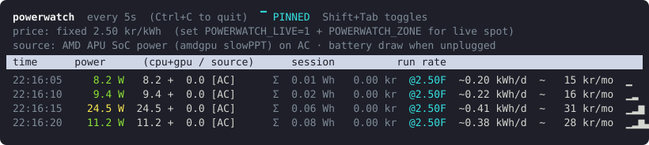

# powerwatch

A live terminal monitor that turns a Linux laptop's power sensors into
cumulative energy (Wh/kWh), a running electricity cost, and a projected
daily/monthly run rate. It reads CPU/SoC power from Intel RAPL or, on AMD APUs
(e.g. the Steam Deck), the `amdgpu` sensor, adds a discrete NVIDIA or AMD GPU if
present, and uses the battery's own draw when unplugged. On a Raspberry Pi 5 it
reads whole-board power from the PMIC instead. (An Intel iGPU needs no separate
reading: it is already inside RAPL.)



Each refresh shows current watts, session energy and cost, a projected
`~kWh/day` and `~cost/month`, and a sparkline of recent power, tagged `[AC]`,
`[BAT]`, or `[PI]` for the live measurement path.

The header is pinned to the top while the rows scroll beneath it. Press
**Shift+Tab** to switch to a scrolling layout that keeps history in your
terminal's scrollback (or start with `POWERWATCH_STICKY=0`). See the
[output reference](docs/display.md) for the columns, width behaviour, and
layout details.

## Install

One line, no clone needed, and re-running the same line updates an existing
install in place:

```bash
curl -fsSL https://raw.githubusercontent.com/mjfwebb/powerwatch/main/install.sh | bash
```

It installs to `~/.local/bin` (override with `POWERWATCH_BIN_DIR`), which must
be on your PATH. On Intel, append `-s -- --with-udev` to also do the one-time
sensor setup below (uses sudo).

From a checkout instead:

```bash
install -Dm755 powerwatch ~/.local/bin/powerwatch
```

The installed copy is a snapshot; re-run either line after pulling or editing
the script to update it. Once installed, `powerwatch update` does this for you,
re-running the installer in place. Extra args pass through to it (e.g.
`powerwatch update --with-udev`), and `POWERWATCH_RAW_URL` selects a fork or
branch.

### Windows 11

Windows 11 is supported, with one requirement: powerwatch is a bash script, so
you run it from a bash shell, either **Git Bash** (ships with
[Git for Windows](https://gitforwindows.org/)) or **WSL**, rather than cmd or
PowerShell. The same one-liner installs it from within either shell. On battery
it reads whole-machine draw from Windows WMI; on AC it adds CPU-package power
when [LibreHardwareMonitor](https://github.com/LibreHardwareMonitor/LibreHardwareMonitor)
is running with its **Remote Web Server** enabled (Options menu), plus the GPU.
Run LibreHardwareMonitor as administrator so it can read CPU power, and leave it
running. The server defaults to `http://localhost:8085/data.json`; point
powerwatch elsewhere with `POWERWATCH_LHM_URL`. Without it, powerwatch sees only
the GPU on AC (no RAPL access on Windows). See
[what powerwatch measures](docs/sensors.md#windows-11-msys2git-bash-cygwin-wsl).

Git Bash's `~/.local/bin` (`/c/Users/<you>/.local/bin`) is not on the Windows
PATH by default; the installer prints a note if so. Add it to your shell, e.g.
`echo 'export PATH="$HOME/.local/bin:$PATH"' >> ~/.bashrc`.

### macOS

macOS is supported, with one requirement: it ships bash 3.2, but powerwatch
needs bash 5.0+, so install a newer one with `brew install bash` (Homebrew's
goes on PATH ahead of the system bash, so the `env bash` shebang picks it up).
powerwatch says so and exits if it ever runs under 5.0. The same one-liner
installs it.

On battery it reads whole-machine draw from the battery itself (IOKit's
`AppleSmartBattery`, via `ioreg`) — accurate and needing no setup, exactly like
Linux on battery. On AC there is no unprivileged power sensor on Apple Silicon,
so powerwatch reads CPU+GPU+ANE package power from `powermetrics`, which needs
root. Grant it passwordless `sudo` once (see below) and AC shows real SoC power;
without it powerwatch is battery-accurate and says in the header that plug-in
power needs `powermetrics`. The sampler is polled at most every
`POWERWATCH_MAC_POLL` seconds (default 5), since each spawn is costly.

To enable the AC path, add a sudoers rule for your user (use the full path from
`command -v powermetrics`, normally `/usr/bin/powermetrics`):

```bash
echo "$USER ALL=(root) NOPASSWD: /usr/bin/powermetrics" \
  | sudo tee "/etc/sudoers.d/powerwatch-powermetrics" >/dev/null
sudo chmod 0440 /etc/sudoers.d/powerwatch-powermetrics
```

This is the macOS analogue of the Intel udev rule below: it grants read-only
access to one power sensor and nothing more. Remove the file to revoke it. See
[what powerwatch measures](docs/sensors.md#macos) for the per-source details.

## Setup: read the CPU power sensor (Intel, one-time)

This step is **Intel only**. Linux restricts the Intel CPU power sensor to root;
let your user read it:

```bash
sudo cp 99-powercap-readable.rules /etc/udev/rules.d/
sudo udevadm control --reload
sudo udevadm trigger --subsystem-match=powercap
sudo chmod -R a+r /sys/devices/virtual/powercap/   # apply now, without a reboot
```

The `/sys/devices/virtual/powercap/` path only exists on Intel hardware, so on
other platforms these commands are not applicable (the `chmod` will report that
the path does not exist). Skip this step there.

Without it powerwatch still runs, but on AC it sees only the GPU and reads low
(it says so in the header); on battery it is accurate either way. **AMD APUs
need no setup**: their `amdgpu` sensor is readable already. **A Raspberry Pi 5
needs no setup** either: its PMIC is read through `vcgencmd` without root, and
reports whole-board power.

> **Raspberry Pi 4 and earlier have no readable power sensor.** The whole-board
> PMIC reading (`vcgencmd pmic_read_adc`) exists only on the Pi 5 and later, and
> these boards have neither RAPL nor a battery, so powerwatch has nothing to
> measure. It still runs and says so in the header. To meter a Pi 4, measure at
> the wall with a smart plug.

See [what powerwatch measures](docs/sensors.md) for the per-source details and
why the Intel sensor is root-only.

## Usage

```bash
powerwatch        # refresh every 5 s (default)
powerwatch 2      # every 2 s
```

Every setting has both a `POWERWATCH_*` environment variable and an equivalent
command-line flag (flags win). Run `powerwatch --help` for the option list, or
see the [configuration reference](docs/configuration.md) for the complete
env-var ⇄ flag table, defaults, and precedence.

### Pricing

By default powerwatch costs energy at a flat rate per kWh:

```bash
POWERWATCH_RATE=1.80 POWERWATCH_CURR=USD powerwatch
```

Set `POWERWATCH_LIVE=1` to fetch live spot prices and build an all-in rate of
`(spot + markup + grid + tax) × VAT`, priced per slot and cached under
`~/.cache/powerwatch/`. It needs `curl` and `jq`, and falls back to
`POWERWATCH_RATE` on any fetch failure.

| Var | Meaning | Default |
|-----|---------|---------|
| `POWERWATCH_LIVE` | enable live spot pricing | `0` |
| `POWERWATCH_ZONE` | bidding zone for the price URL | _(none)_ |
| `POWERWATCH_RATE` | fixed price per kWh | `2.50` |
| `POWERWATCH_CURR` | currency label | _(none)_ |
| `POWERWATCH_MARKUP` / `_GRID` / `_TAX` | fees added to the spot price, per kWh | `0` |
| `POWERWATCH_VAT` | VAT / sales-tax multiplier | `1` |

Live pricing defaults to the free
[elprisetjustnu.se](https://www.elprisetjustnu.se/) (Nord Pool) API; just set
your `POWERWATCH_ZONE`:

```bash
POWERWATCH_LIVE=1 POWERWATCH_ZONE=<zone> \
  POWERWATCH_MARKUP=0.08 POWERWATCH_GRID=0.30 POWERWATCH_VAT=1.25 powerwatch
```

For the full variable list, bringing your own JSON provider, and static
time-of-use tariffs (e.g. [`examples/arizona-phoenix`](examples/arizona-phoenix)),
see the [pricing guide](docs/pricing.md). Price data:
© [elprisetjustnu.se](https://www.elprisetjustnu.se/).

## Accuracy

On AC this is a compute estimate: RAPL plus dGPU leaves out the display
backlight, AC-adapter conversion loss (~10-15%), USB peripherals and battery
charging, so it undercounts what your wall meter sees. For bill-accurate
numbers, measure at the socket with a smart plug. On battery, the battery's own
power reading covers the whole machine and is genuinely accurate. See
[what powerwatch measures](docs/sensors.md) for what each source covers and the
sysfs paths it reads.

## Contributing

Tests live in `tests/` and run with
[bats](https://github.com/bats-core/bats-core) (`bats tests`); CI also runs
`shellcheck`. See [CONTRIBUTING.md](CONTRIBUTING.md) for setup and conventions.

## License

Released under the [MIT License](LICENSE).
